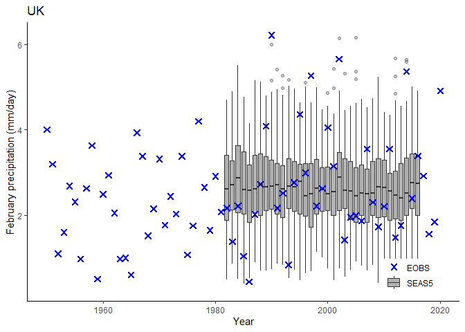
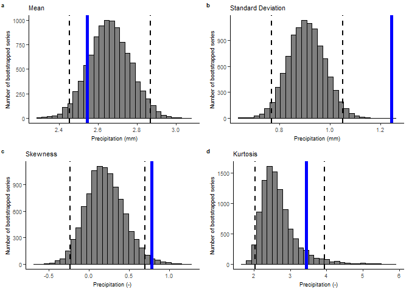
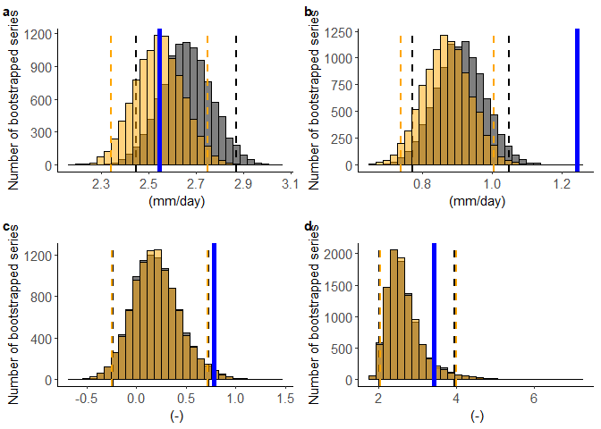
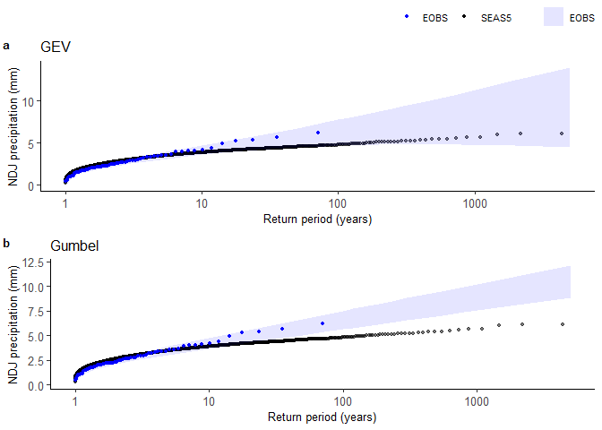

Model Fidelity
================
Timo Kelder
June 4, 2020

In this notebook, we assess the model fidelity of the SEAS5 UNSEEN
ensemble over the UK compared to EOBS. We start by bootstrapping the
ensemble and then compare the extreme value distributions for both. For
specifics, please see the paper.

## Import data and packages

``` r
dir='C:/Users/Timo/OneDrive - Loughborough University/GitHub/UNSEEN-open/Data'

library('ggplot2')

library(moments)
library(ggpubr)
```

    ## Warning: package 'ggpubr' was built under R version 3.6.3

    ## Loading required package: magrittr

``` r
library(extRemes)
```

    ## Loading required package: Lmoments

    ## Loading required package: distillery

    ## 
    ## Attaching package: 'extRemes'

    ## The following objects are masked from 'package:stats':
    ## 
    ##     qqnorm, qqplot

### Load the data

The data is downloaded from CDS. see the Notebooks of the first step of
the workflow. In notebook 2.1Convert, we load the SEAS5 and EOBS netcdf
files and convert them to dataframes, that can be used in R. Here, we
load the dataframes.

``` r
EOBS_UK_weighted_df = read.csv('../../Data/EOBS_UK_weighted_df.csv',row.names = 1)
SEAS5_UK_weighted_df = read.csv('../../Data/SEAS5_UK_weighted_df.csv',row.names = 1)
```

``` r
ensemble = SEAS5_UK_weighted_df
obs = EOBS_UK_weighted_df
ggplot()+
  geom_boxplot(data=ensemble,mapping = aes(x=Year,y=Precipitation,group=Year,fill='SEAS5'),alpha=0.3 )+ ##Seas5 color is defined manually
  geom_point(data=obs,aes(x = Year,y = Precipitation,col='EOBS'),shape=4,size=2,stroke=1.5)+
  theme_classic()+
  scale_fill_manual(name=NULL,values=c("SEAS5"="black"))+ ##Here SEAS5 color is defined
  scale_colour_manual(name=NULL,values=c("EOBS"="blue"))+ ## And ERA5 color
  ylab('February precipitation (mm/day)')+
  ggtitle('UK')+
  theme(legend.position = c(.95, .02),
        legend.justification = c("right", "bottom"),
        legend.spacing.y = unit(-0.2, 'cm'),
        legend.title = element_blank())+#,
  # text=element_text(size=7),
  #   axis.text = element_text(size=7))+
  guides(color = guide_legend(order=1),
         fill = guide_legend(order=2))
```

<!-- -->

``` r
Boottest <- function(ensemble, obs,xlabel='') {
  bootstrapped_series=sample(ensemble,size = length(obs)*10000,replace = T) #For WC
  bootstrapped_array=array(bootstrapped_series,dim = c(length(obs),10000)) #Creates an array with 10.000 series of 35 values

  plot_hist <- function(bootstrapped_array,fun,main,col,units) {
    bootstrapped_fun=apply(bootstrapped_array,MARGIN = 2,FUN = fun)
    ggplot()+
      geom_histogram(aes(x=bootstrapped_fun),color='black',fill=col,alpha=0.5,bins=30)+
      geom_vline(aes(xintercept=quantile(bootstrapped_fun,probs = c(0.025,0.975))),
                color="black", linetype="dashed", size=1)+
      geom_vline(aes(xintercept=fun(obs)),
                color="blue", size=2)+
      labs(title=main,y= 'Number of bootstrapped series',x =paste0(xlabel," (",units,")"))+
      theme_classic()+
      theme(text=element_text(size=7),
          axis.text = element_text(size=7))
      
  }
  
  
  p1=plot_hist(bootstrapped_array,fun=mean,main = 'Mean',col='black',units = 'mm')
  p2=plot_hist(bootstrapped_array,sd,'Standard Deviation','black',units = 'mm')
  p3=plot_hist(bootstrapped_array,skewness,'Skewness','black',units = '-')
  p4=plot_hist(bootstrapped_array,kurtosis,'Kurtosis','black',units = '-')
  
  ggarrange(p1,p2,p3,p4,
            labels = c("a", "b","c","d"),
            font.label = list(size = 7, color = "black", face ="bold", family = NULL),
            ncol = 2, nrow = 2)
  
}

Boottest(ensemble = SEAS5_UK_weighted_df$Precipitation,obs = EOBS_UK_weighted_df$Precipitation,xlabel = 'Precipitation')
```

<!-- -->

``` r
Boottest_biascor <- function(obs,ensemble,fontsize) {
bootstrapped_ens=sample(ensemble,size = length(obs)*10000,replace = T) #The original raw data
bootstrapped_ens=array(bootstrapped_ens,dim = c(length(obs),10000)) #Creates an array with 10.000 series of 35 values
ensemble_ratio= ensemble * mean(obs)/mean(ensemble) ## The simple ratio as mean bias corrected series
bootstrapped_ensratio=sample(ensemble_ratio,size = length(obs)*10000,replace = T) #The original raw data
bootstrapped_ensratio=array(bootstrapped_ensratio,dim = c(length(obs),10000)) #Creates an array with 10.000 series of 35 values

plot_hist_combined <- function(bootstrapped_ens,bootstrapped_ensratio,fun,main,units,fontsize) {
  bootstrapped_fun=apply(bootstrapped_ens,MARGIN = 2,FUN = fun)
  bootstrapped_fun_ratio=apply(bootstrapped_ensratio,MARGIN = 2,FUN = fun)

  ggplot()+
    geom_histogram(aes(x=bootstrapped_fun),color='black',fill='black',alpha=0.5,bins=30)+
    geom_vline(aes(xintercept=quantile(bootstrapped_fun,probs = c(0.025,0.975))),
              color="black", linetype="dashed", size=1)+
    geom_histogram(aes(x=bootstrapped_fun_ratio),color='black',fill='orange',alpha=0.5,bins=30)+
    geom_vline(aes(xintercept=quantile(bootstrapped_fun_ratio,probs = c(0.025,0.975))),
              color="orange", linetype="dashed", size=1)+

    geom_vline(aes(xintercept=fun(obs)),
              color="blue", size=2)+
    labs(title=main,y= 'Number of bootstrapped series',x =paste0(" (",units,")"))+
    theme_classic()+
    theme(text=element_text(size=fontsize),
        axis.text = element_text(size=fontsize))
    
}


p1_comb=plot_hist_combined(bootstrapped_ens,bootstrapped_ensratio,fun=mean,main = '',units = 'mm/day',fontsize=fontsize)#Mean
p2_comb=plot_hist_combined(bootstrapped_ens,bootstrapped_ensratio,fun=sd,main = '',units = 'mm/day',fontsize=fontsize)#Standard Deviation
p3_comb=plot_hist_combined(bootstrapped_ens,bootstrapped_ensratio,fun=skewness,main = '',units = '-',fontsize=fontsize)#Skewness
p4_comb=plot_hist_combined(bootstrapped_ens,bootstrapped_ensratio,fun=kurtosis,main = '',units = '-',fontsize=fontsize)#Kurtosis

ggarrange(p1_comb,p2_comb,p3_comb,p4_comb,
          labels = c("a", "b","c","d"),
          font.label = list(size = fontsize, color = "black", face ="bold", family = NULL),
          ncol = 2, nrow = 2)
}


Boottest_biascor(ensemble = SEAS5_UK_weighted_df$Precipitation,obs = EOBS_UK_weighted_df$Precipitation,fontsize = 11)#%>%
```

<!-- -->

``` r
    # ggsave(filename = "graphs/Fidelity_south2.pdf",width =180,height = 180, units='mm',dpi=300)
```

Plot the extreme value distributions

``` r
EVT_plot <- function(obs,ensemble,GEV_type,main,ylim=NA) {
  ##We plot the GEV distribution for ERA5 and empirical data for SEAS5
  fit_obs <- fevd(x = obs, threshold = NULL, threshold.fun = ~1, location.fun = ~1,
      scale.fun = ~1, shape.fun = ~1, use.phi = FALSE,
      type = GEV_type,method = "MLE", initial = NULL, #type= c("GEV", "GP", "PP", "Gumbel", "Exponential"), method= c("MLE", "GMLE", "Bayesian", "Lmoments")
      span=NULL, units = NULL, time.units = "days", period.basis = "year", ## time and period only important for labelling and do not influence the calculation
      na.action = na.fail, optim.args = NULL, priorFun = NULL,
      priorParams = NULL, proposalFun = NULL, proposalParams = NULL,
      iter = 9999, weights = 1, blocks = NULL, verbose = FALSE) 
  
  ##Now calculate the return levels and their confidence intervals for each return period within rperiods
  rperiods = c(seq(from = 1.01, to = 1.5, by =0.1),1.7,2,3, 5, 10, 20, 50, 80, 100, 120, 200, 250, 300, 500, 800,2000,5000)
  rvs_obs=ci.fevd(fit_obs,alpha = 0.05,type='return.level',return.period = rperiods,method ="normal") 
  colnames(rvs_obs) = c('Obs_l','Obs','Obs_h') #Rename the col
  GEV_obs=data.frame(cbind(rvs_obs,rperiods)) ##Make a datafram for ggplot
  
  ##Add the emipirical data
  rp_obs=length(obs)/1:length(obs)## these are the (empirical) return periods for the sorted datapoints
  obs_sorted=sort(obs,decreasing = T)##For example, the highest extreme has a rp of 35 years, the second highest 17.5, third highest 11.7 etc.
  datapoints_obs=data.frame(cbind(rp_obs,obs_sorted))

  
  rp_S5=length(ensemble)/1:length(ensemble) #SEAS5 has return periods up to 3800 years
  ensemble_sorted=sort(ensemble,decreasing = T) 
  datapoints_S5=data.frame(cbind(rp_S5,ensemble_sorted))
  
    ##And plot
cols=c("SEAS5"="black","EOBS"="blue") ##for  the legend
  ggplot(data = datapoints_S5,aes(x=rp_S5))+
    geom_point(aes(y = ensemble_sorted,col='SEAS5'),alpha=0.5,size=1)+
    geom_ribbon(data=GEV_obs,aes(ymin=Obs_l,ymax=Obs_h,x=rperiods,fill='EOBS'), alpha=0.1)+
    geom_point(data=datapoints_obs,aes(x=rp_obs,y = obs_sorted,col='EOBS'), size=1)+
    scale_x_continuous(trans='log10')+
    scale_fill_manual(name="Data",values=cols) +
    scale_colour_manual(name=NULL,values=cols) +
    theme_classic()+
    theme(legend.position = c(.95, .05),
      legend.justification = c("right", "bottom"),
      legend.box.just = "right",
      legend.title = element_blank(),
      text=element_text(size=10),
        axis.text = element_text(size=10))+
    labs(title=main,y= 'NDJ precipitation (mm)',x ='Return period (years)')+
    if (is.finite(ylim)){
      coord_cartesian(ylim = c(0, ylim))
    }
}
  
GEV1=EVT_plot(ensemble = SEAS5_UK_weighted_df$Precipitation,obs = EOBS_UK_weighted_df$Precipitation,main='GEV',GEV_type = 'GEV')#%>%
    # ggsave(filename = "graphs/ERA5Gev_SEAS5corrections_region1.png",width =180,height = 180, units='mm',dpi=300)
Gumbel1=EVT_plot(ensemble = SEAS5_UK_weighted_df$Precipitation,obs = EOBS_UK_weighted_df$Precipitation,main='Gumbel',GEV_type = 'Gumbel')#%>%
    # ggsave(filename = "graphs/ERA5Gumbel_SEAS5corrections_region1.png",width =180,height = 180, units='mm',dpi=300)

ggarrange(GEV1,Gumbel1,
          labels = c("a", "b"),#,"c","d"),
          common.legend = T,
          font.label = list(size = 10, color = "black", face ="bold", family = NULL),
          ncol = 1, nrow = 2) #%>%
```

<!-- -->

``` r
  # ggsave(filename = "graphs/Biascor.png",width =180,height = 180, units='mm',dpi=300)
```
